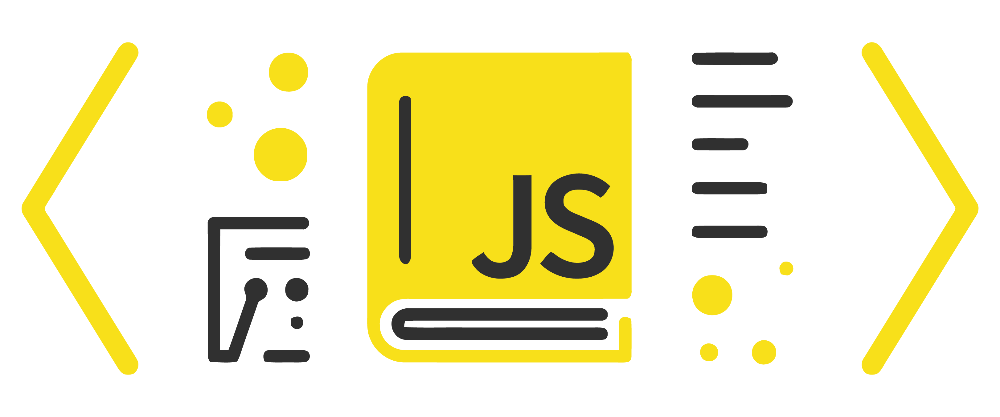

<h1 align="center">JavaScript Coding Challenges </h1>

## 1. Multiples of 3 or 5

If we list all the natural numbers below 10 that are multiples of 3 or 5, we get 3, 5, 6 and 9. The sum of these multiples is 23. Finish the solution so that it returns the sum of all the multiples of 3 or 5 below the number passed in.

Note: If the number is a multiple of both 3 and 5, only count it once. Also, if a number is negative, return 0.

```js
const solution = (number) => {
  //Write Your solution Here
};

console.log(solution(0)); // 0
console.log(solution(-15)); // 0
console.log(solution(10)); // 23
console.log(solution(20)); // 78
console.log(solution(200)); // 9168
```

<details><summary style="cursor:pointer">Solution</summary>

```js
const solution = (number) => {
  let sum = 0;
  for (let i = 0; i < number; i++) {
    if (i % 3 === 0 || i % 5 === 0) {
      sum += i;
    }
  }
  return sum;
};
```

</details>

---
**[⬆ Back to Top](JavaScript-Coding-Challenges)**

## 2. Sum of an array

Take an array of integer data type of size 10 And pritn the sum of those 10 integers.


```js
const solution = (array) => {
  //Write Your solution Here
};

console.log(solution([1, 2, 3, 4, 5, 6, 7, 8, 9, 10])); // 55
console.log(solution([22, 11, 55, 66, 77, 88, 99, 44, 33, 10 ])); // 505
console.log(solution([12, 12, 65, 36, 87, 18, 79, 14, 73, 70 ])); // 466
```

<details><summary style="cursor:pointer">Solution</summary>

```js

const solution = (array) =>{
    let sum = 0;
    for(let i = 0; i < array.length; i++){
        sum += array[i];
    }
    return sum;
};
```

</details>

---
**[⬆ Back to Top](JavaScript-Coding-Challenges)**